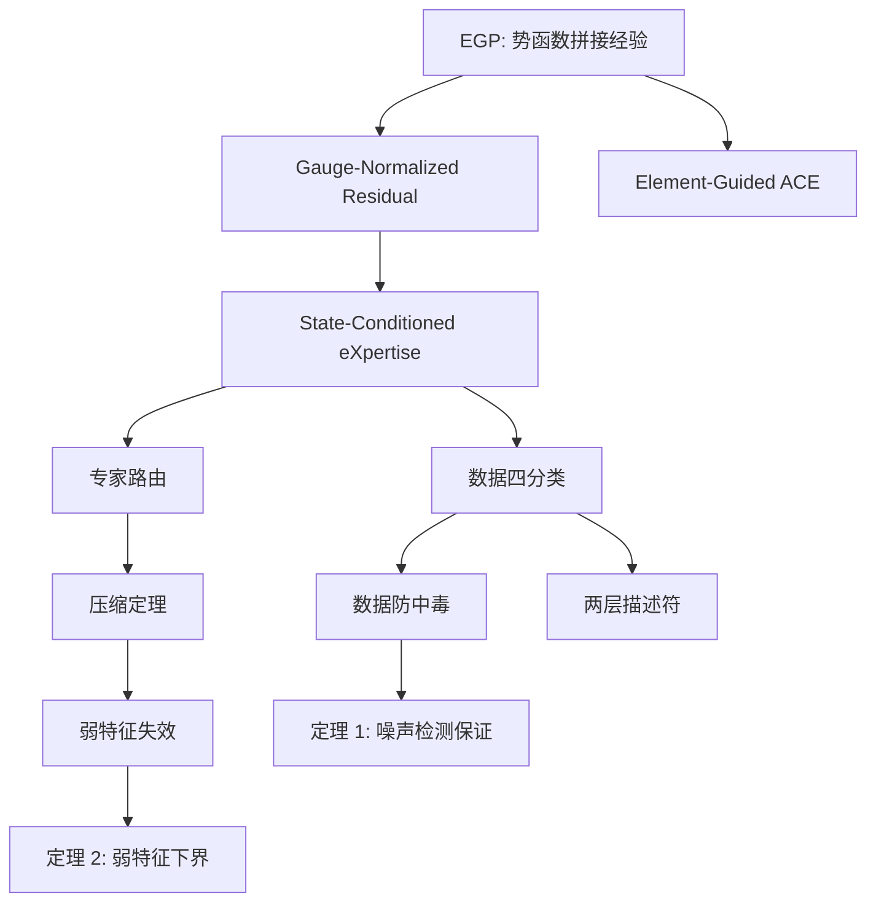

# 思想演化地图

从 EGP 多专家拼接 → SCX 通用 ML 理论框架的概念跃迁路线图。

## 主线：四个关键跃迁

### 跃迁 1：经验观察 → 形式化概念（6/14 → 6/23）

```
EGP 多专家势函数拼接
    │
    ├─ 观察到：同一势函数在不同构型区域精度不同
    │  [[2026-06-14_EGP概念萌芽]] — 两层 EGP 方案提出
    │
    ├─ 尝试：用 gauge fixing 规范化专家
    │  [[2026-06-19_ACE专家代数]] — gauge-normalized residual ACE
    │
    └─ 升华：这不仅仅是材料科学问题
       [[2026-06-23_SCX概念形成]] — SCX 概念正式剥离
       核心洞见：专家可靠性不是全局常数，而是状态条件函数
```

### 跃迁 2：数学直觉 → 形式化证明（6/23 → 6/24）

```
SCX 概念
    │
    ├─ 定义体系：SCX_m(s), V(s), 数据四分类
    │  [[State-Conditioned eXpertise]]
    │
    ├─ 命题 1-3：全局排序不足、高误差次优、状态条件加权
    │  [[2026-06-24_数学框架初稿]]
    │
    └─ 区分：Noise vs Hard State
       [[数据四分类]] · [[数据防中毒]]
```

### 跃迁 3：框架 → 可运行系统（6/25 → 6/26）

```
数学框架
    │
    ├─ v0.1.0: 30 files, 259 tests
    │  [[2026-06-25_v0.1.0发布]]
    │
    ├─ v0.2.0: Compress Theorem + Governance Protocol
    │  [[压缩定理]] · [[专家路由]]
    │
    └─ v0.3.0: 两层描述符 + 数据防中毒验证
       [[2026-06-26_v0.3.0_两层描述符]]
       [[两层描述符]] · [[弱特征失效]]
```

### 跃迁 4：定理完成 + 论文规划落地（6/27）

```
理论 + 实验积累
    │
    ├─ 定理 1 证明完成：多专家一致性噪声检测的充分条件
    │  Hoeffding + Chernoff 界，条件期望分解
    │
    ├─ 定理 2 证明完成：弱特征失效下界
    │  Fano 不等式 + 耦合论证 + Pinsker 不等式
    │
    ├─ 方案 D 决策：两阶段发表（Paper 1 轻量版 + Paper 3 完整版）
    │  [[../05_决策/论文规划_定理定位审视]]
    │
    └─ 论文规划合并：三份文件整合为单一权威来源
       [[../05_决策/论文规划]]
```

## 旁线：从具体到抽象的支撑概念

```
Element-Guided ACE (EGP 专有)
    └─→ [[Element-Guided ACE]]

Gauge-Normalized Residual (ACE 专家代数)
    └─→ [[Gauge-Normalized Residual]]

State-Conditioned Expertise (通用)
    └─→ [[State-Conditioned eXpertise]]
        ├─→ [[数据四分类]]
        ├─→ [[数据防中毒]]
        ├─→ [[专家路由]]
        ├─→ [[压缩定理]]
        └─→ [[弱特征失效]]
```

## 概念间的衍生关系



## 按时间线的文件索引

| 日期 | 概念突破 | 时间线笔记 |
|------|---------|-----------|
| 06-14 | 两层 EGP 方案 | [[2026-06-14_EGP概念萌芽]] |
| 06-15 | AlN ModelB 提交 | [[2026-06-15_AlN_ModelB]] |
| 06-19 | ACE 专家代数 | [[2026-06-19_ACE专家代数]] |
| 06-20 | stress10 验证 | [[2026-06-20_AlN验证]] |
| 06-23 | **SCX 概念形成** | [[02_概念/01_时间线/2026-06-23_SCX概念形成]] |
| 06-24 | 数学框架初稿 | [[2026-06-24_数学框架初稿]] |
| 06-25 | v0.1.0 发布 | [[2026-06-25_v0.1.0发布]] |
| 06-26 | v0.3.0 两层描述符 | [[2026-06-26_v0.3.0_两层描述符]] |
| **06-27** | **🔥 定理 1+2 证明完成 + 论文规划合并** | **[[2026-06-27_定理证明与论文规划]]** |
